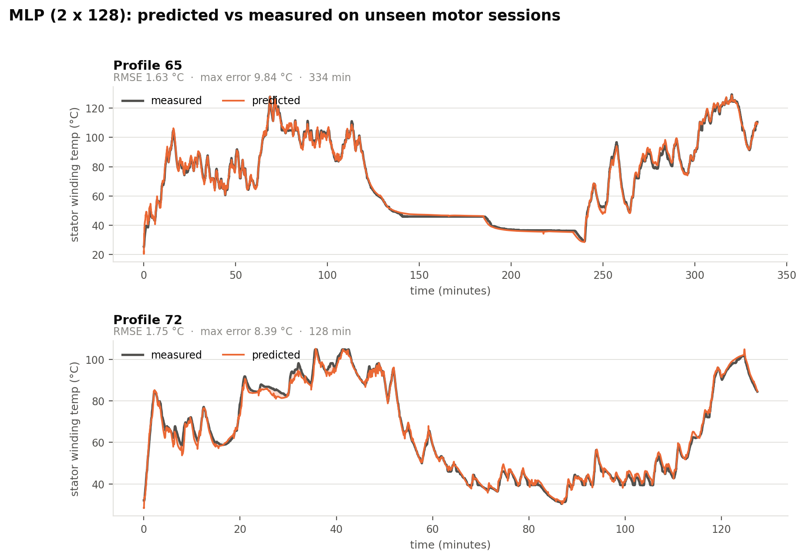
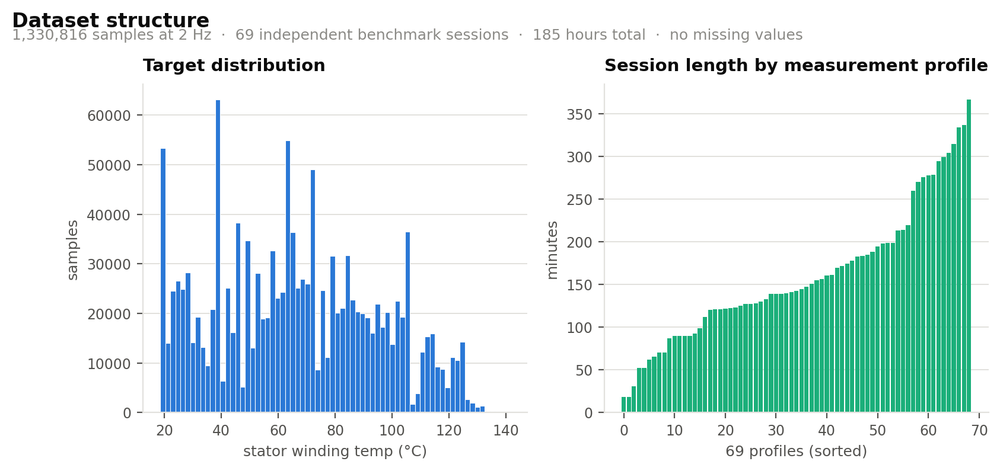
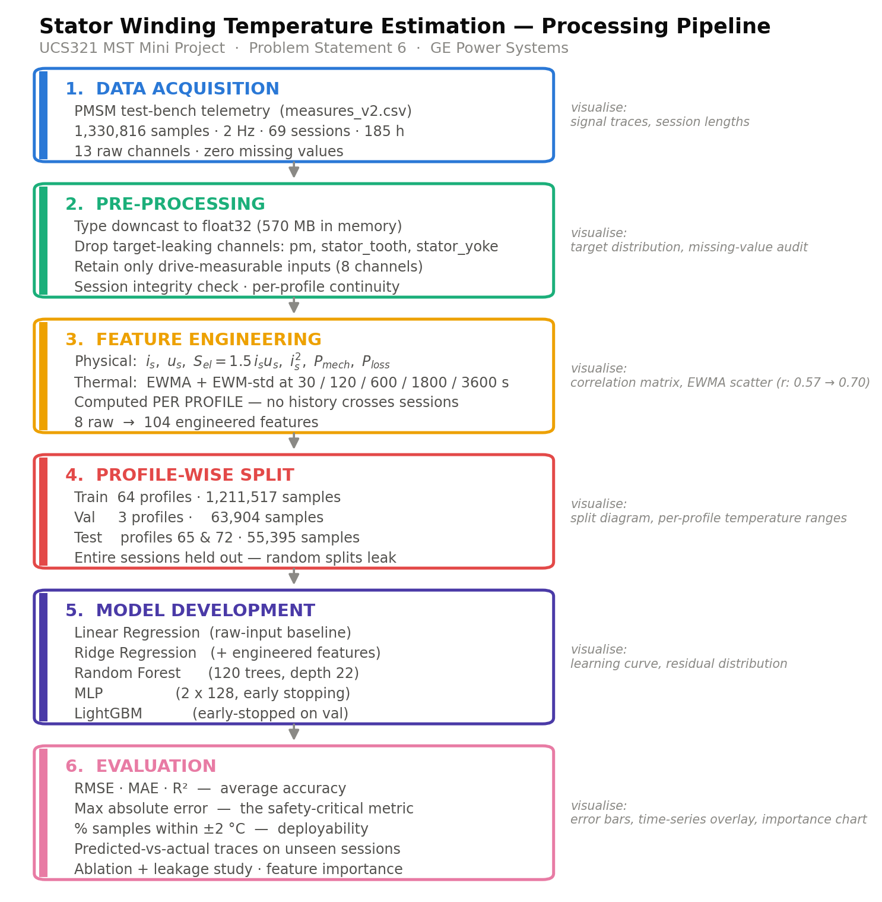
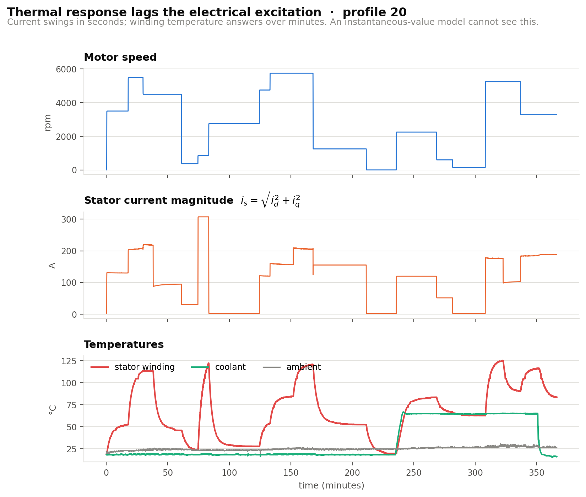
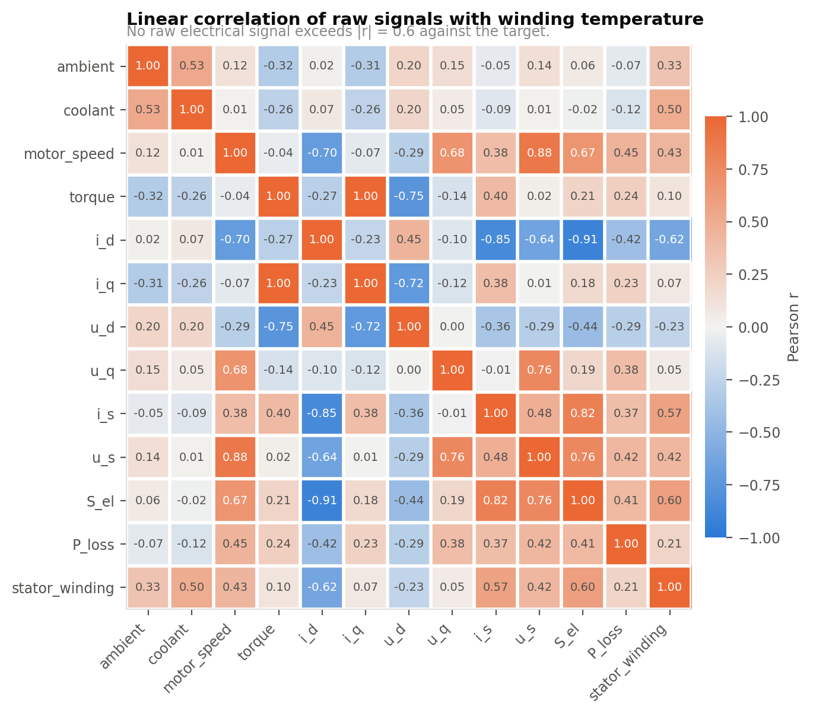
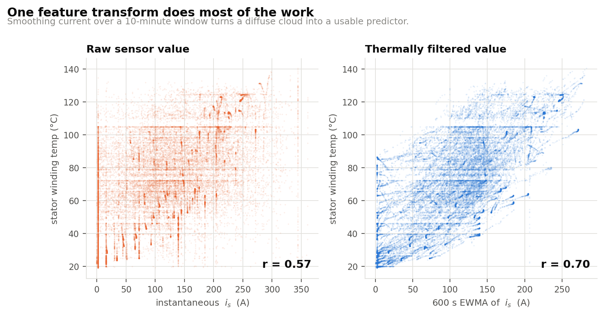
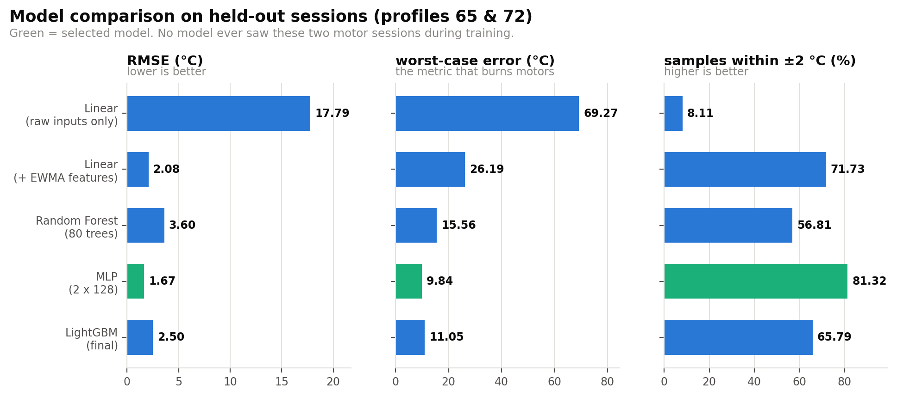
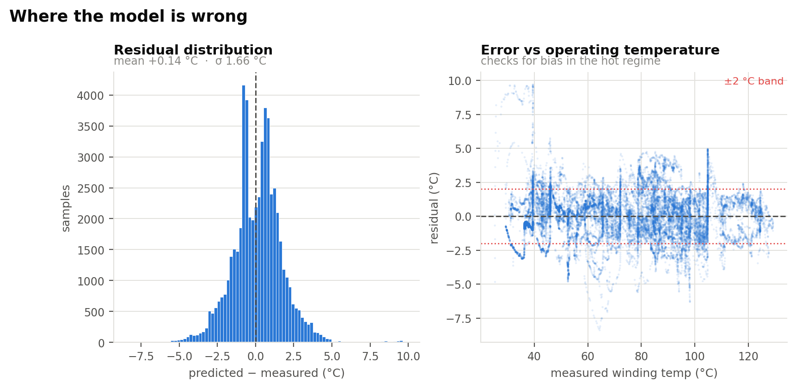
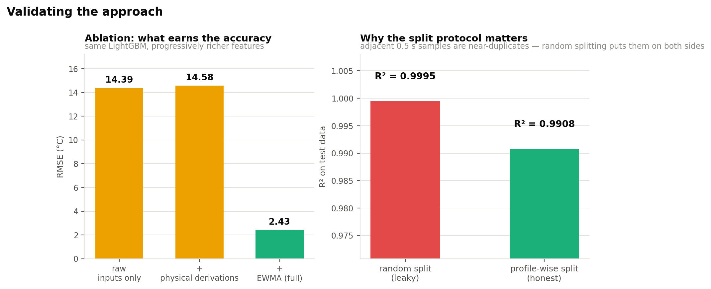
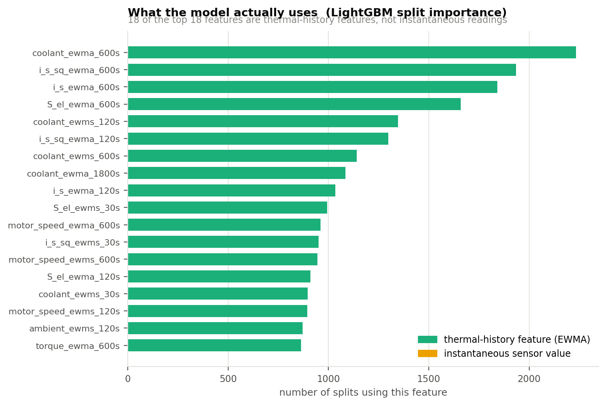

# PMSM Thermal Virtual Sensor

**Estimating electric-motor stator winding temperature from signals a drive already measures — a software replacement for a physical thermocouple.**

[](https://www.python.org/)
[](https://scikit-learn.org/)
[](https://lightgbm.readthedocs.io/)
[](notebooks/motor_temperature_prediction.ipynb)
[](#evaluation-metrics)
[](LICENSE)

---

## Contents

[Overview](#overview) · [Results at a glance](#results-at-a-glance) · [Project structure](#project-structure) · [Dataset](#dataset) · [The pipeline](#the-pipeline) · [Evaluation metrics](#evaluation-metrics) · [Model comparison](#model-comparison) · [Hyperparameter tuning](#hyperparameter-tuning) · [Final test evaluation](#final-test-evaluation) · [Model diagnostics](#model-diagnostics) · [Using the trained model](#using-the-trained-model) · [Setup and reproducibility](#setup-and-reproducibility) · [Technology stack](#technology-stack) · [Key design decisions](#key-design-decisions) · [Known limitations](#known-limitations) · [Future improvements](#future-improvements) · [References](#references)

---

## Overview

A permanent-magnet synchronous motor fails when its stator winding insulation cooks. Class-H insulation is rated to roughly 180 °C, and insulation life halves for every ~10 °C of sustained overtemperature. Winding temperature is therefore the binding constraint on how hard a drive may push the machine — a controller that knows it accurately can use the motor's full short-term overload capability, and one that does not must derate conservatively and give up torque the machine could physically have delivered.

The problem is that **you cannot cheaply measure it in a production motor.** A thermocouple bonded to a varnished, high-voltage winding means extra wiring through a sealed housing, an extra failure mode, and a cost that does not survive a volume BOM. Test benches have these sensors; shipped motors do not.

This project builds the software replacement — a *virtual sensor*. It estimates winding temperature from the eight quantities a drive already measures for field-oriented control, with no thermal instrumentation of its own.

<p align="center">
  
  <br>
  <em>Predicted vs measured on two motor sessions the model has never seen.</em>
</p>

## Results at a glance

Evaluated on **entire measurement sessions held out from training** (profiles 65 and 72 — 55,395 samples, 7.7 hours of running):

| Metric | Value | What it means |
|---|---|---|
| **RMSE** | **1.54 °C** | typical error, penalising large misses |
| **MAE** | **1.10 °C** | typical error, plain average |
| **R²** | **0.9965** | 99.65 % of the variance explained |
| **Max absolute error** | **11.32 °C** | worst single sample — the deployability number |
| **Within ±2 °C** | **84.2 %** | fraction of operating time good enough to act on |

Selected model: **MLP, 2 × 128 hidden units**, tuned by grouped randomised search.

Three findings matter more than the table:

1. **Feature engineering beat every model.** An unchanged linear regression goes from R² 0.53 to 0.9936 purely because its inputs encode thermal history.
2. **Random splitting would have inflated this by ~4×.** At 2 Hz, consecutive rows are near-duplicates. Holding out whole sessions is a correctness requirement, not a refinement.
3. **RMSE and worst-case error disagree, and the choice matters.** The tuned MLP has the best RMSE; tuned HistGradientBoosting has the lowest worst case (9.53 °C). For a thermal protection limit, that second column is arguably the one that governs.

## Project structure

```
.
├── data/raw/                              dataset goes here (git-ignored, ~300 MB)
├── notebooks/
│   └── motor_temperature_prediction.ipynb full analysis, executed end to end
├── src/
│   ├── paths.py            repo-relative paths, redirectable via env vars
│   ├── features.py         physical derivations + EWMA construction
│   ├── build_features.py   builds the 104-feature matrix
│   ├── train.py            model ladder, ablation, leakage study
│   ├── tune.py             grouped hyperparameter search + model export
│   ├── results_figs.py     result figures + metrics table
│   ├── eda.py              exploratory figures
│   ├── flow_diagram.py     pipeline diagram
│   └── viz.py              shared plot styling
├── models/
│   └── final_temperature_model.joblib     tuned model + feature list + metrics
├── figures/                               all 10 figures
├── reports/                               write-up (19 pp) and slide deck (19 slides)
├── run.py                                 one entry point for the whole pipeline
├── run.bat                                Windows double-click wrapper
├── predict.py                             inference on new telemetry
├── metrics_table.csv                      model comparison, machine-readable
└── requirements.txt
```

## Dataset

[Electric Motor Temperature](https://www.kaggle.com/datasets/wkirgsn/electric-motor-temperature) — PMSM dynamometer telemetry recorded by the Department of Power Electronics and Electrical Drives (LEA), Paderborn University.

| Property | Value |
|---|---|
| Samples | 1,330,816 |
| Sampling rate | 2 Hz (0.5 s) |
| Independent sessions (`profile_id`) | 69 |
| Duration | ≈ 185 hours |
| Missing values | 0 |
| Target range | 18.6 – 141.4 °C |

### Schema

| Column | Physical meaning | Role |
|---|---|---|
| `ambient` | ambient air temperature (°C) | input |
| `coolant` | coolant outlet temperature (°C) | input |
| `u_d`, `u_q` | terminal voltage, rotor dq frame (V) | input |
| `i_d`, `i_q` | phase current, rotor dq frame (A) | input |
| `motor_speed` | rotor speed (rpm) | input |
| `torque` | shaft torque (N·m) | input |
| **`stator_winding`** | **winding temperature (°C)** | **target** |
| `stator_tooth`, `stator_yoke`, `pm` | other thermocouple readings | **dropped — leakage** |
| `profile_id` | measurement session id | grouping key |

`measures_v2.csv` is ~300 MB and is not committed. Download it and place it in `data/raw/`.

<p align="center">
  
</p>

## The pipeline

<p align="center">
  
</p>

### 1. Pre-processing — deleting the features that would have scored best

Three extra thermocouple channels (`stator_tooth`, `stator_yoke`, `pm`) correlate with the target at **r > 0.95**. All three are discarded, for two reasons that both matter:

- **It defeats the objective.** Those sensors are exactly the hardware the virtual sensor exists to replace. A model that needs `stator_tooth` cannot run on a motor that has neither.
- **It is target leakage.** Tooth and yoke sit millimetres from the winding in the same laminated iron and share its thermal mass. Such a model interpolates between adjacent thermocouples rather than learning thermodynamics, and the accuracy would not transfer to any other machine.

`coolant` and `ambient` are kept — they are cheap external sensors fitted to any liquid-cooled drive. Eight inputs remain. All channels are downcast to `float32`, and each `profile_id` is verified to be one contiguous recording, because every feature below depends on that.

### 2. EDA — the observation the project rests on

<p align="center">
  
</p>

Current changes in **seconds**; winding temperature answers over **minutes**, and keeps rising after the current has stepped down. Winding temperature is not a function of the present current — it is a function of accumulated loss over the recent past. A model fed only instantaneous values is being asked to infer a state variable from its input, which for a system with memory is impossible in principle, not merely difficult.

That shows up numerically: no raw electrical channel exceeds **|r| = 0.63** against the target.

<p align="center">
  
</p>

### 3. Feature engineering — derived from the thermal ODE, not from trial and error

Treating the winding as a lumped thermal mass gives a first-order system:

$$
C_{th}\frac{d\vartheta}{dt} = P_{loss}(t) - \frac{\vartheta - \vartheta_{amb}}{R_{th}}
\qquad\Longrightarrow\qquad
\vartheta(t)=\frac{1}{\tau}\int_{-\infty}^{t} e^{-(t-s)/\tau} P_{loss}(s)\,ds
$$

The winding temperature **is** an exponentially weighted integral of past losses — and the discrete-time realisation of that integral is an EWMA, $y_k = \alpha x_k + (1-\alpha)y_{k-1}$. So the feature set is the physics written down rather than a smoothing trick.

**Physical derivations** — with $i_s^2$ present because copper loss is $I^2R$, and the model should not have to rediscover the square law from orthogonal components:

$$i_s=\sqrt{i_d^2+i_q^2} \qquad u_s=\sqrt{u_d^2+u_q^2} \qquad S_{el}=\tfrac{3}{2}i_s u_s \qquad P_{mech}=\tfrac{2\pi}{60}\tau n \qquad P_{loss}\approx S_{el}-|P_{mech}|$$

**Thermal history** — EWMA and exponentially weighted standard deviation of nine signals at five time constants (**30 s, 120 s, 600 s, 1800 s, 3600 s**), bracketing the copper, iron, housing and coolant responses. Every one is computed **within a `profile_id` group**, so no thermal state crosses a session boundary.

**8 raw channels → 104 features.** One transform, examined alone before any model is fitted:

<p align="center">
  
</p>

### 4. Splitting — never at random

Samples are 0.5 s apart and a motor's temperature cannot change in half a second, so consecutive rows are near-duplicates. A random split scatters near-identical samples across both sides, and the test set ends up effectively inside the training set.

| Partition | Profiles | Samples |
|---|---|---|
| Train | 64 | 1,211,517 |
| Validation | 60, 62, 74 | 63,904 |
| **Test (held out)** | **65, 72** | **55,395** |

Profiles 65 and 72 are the benchmark sessions used in the published literature on this test bench.

## Evaluation metrics

| Metric | Formula | Why it is here |
|---|---|---|
| **MAE** | $\frac{1}{n}\sum\|y_i-\hat{y}_i\|$ | average error in °C, easy to reason about |
| **RMSE** | $\sqrt{\frac{1}{n}\sum(y_i-\hat{y}_i)^2}$ | penalises large misses — the ones that burn motors |
| **R²** | $1-\frac{\sum(y_i-\hat{y}_i)^2}{\sum(y_i-\bar{y})^2}$ | share of variance explained; flattering on a wide-range target |
| **Max abs error** | $\max\|y_i-\hat{y}_i\|$ | sizes the safety margin below the insulation rating |
| **Within ±2 °C** | $\frac{1}{n}\sum\mathbb{1}(\|y_i-\hat{y}_i\|\le 2)$ | fraction of running time the estimate is directly usable |

The last two exist because average error is the wrong headline for a safety limit: a model with 1 °C mean error and one 20 °C underestimate still destroys the motor. R² is reported because it is conventional, but on a target spanning 18–141 °C it looks excellent long before the model is actually usable.

## Model comparison

Five models, identical training partition, identical held-out sessions, no tuning yet — the point of the ladder is that each rung must justify itself against the one below.

| Model | Configuration | RMSE (°C) | MAE (°C) | R² | Max err (°C) | Within ±2 °C |
|---|---|---|---|---|---|---|
| Linear regression | 8 raw inputs, OLS | 17.79 | 14.37 | 0.5324 | 69.27 | 8.1 % |
| Ridge regression | α = 1.0, 104 features | 2.08 | 1.54 | 0.9936 | 26.19 | 71.7 % |
| Random Forest | 80 trees, depth 16 | 3.60 | 2.49 | 0.9808 | 15.56 | 56.8 % |
| **MLP** | 2 × 128, early stopping | **1.67** | **1.26** | **0.9959** | **9.84** | **81.3 %** |
| LightGBM | 743 trees, early-stopped | 2.50 | 1.85 | 0.9908 | 11.05 | 65.8 % |

<p align="center">
  
</p>

**The first two rows are the project's central result.** Same algorithm, same data, same training procedure — RMSE falls from 17.79 °C to 2.08 °C and R² rises from 0.53 to 0.99 solely because the inputs now encode thermal history. Domain-informed feature engineering outperformed every increase in model sophistication attempted here.

**The neural net beats both tree ensembles**, which is not the usual expectation on tabular data. Tree ensembles are piecewise-constant: a prediction is the mean of the training samples in a leaf, so they cannot produce a value outside the range they saw. The held-out sessions contain operating points the 64 training profiles never visit, and at those points a tree can only clamp to its nearest leaf. An MLP is smooth and continues the trend. Under genuine extrapolation, smoothness is the decisive property.

**Ridge regression beats LightGBM.** Once the features encode the physics, the residual relationship is close to linear, and a low-variance estimator generalises across sessions better than a high-capacity one.

## Hyperparameter tuning

The top neural model and a gradient-boosting counterpart were tuned with `RandomizedSearchCV` under **`GroupKFold(n_splits=3)` grouped on `profile_id`** — so a candidate is never scored on a session it was fitted on. A plain `KFold` here would silently undo the entire split discipline. The search ran on every 10th training sample; the winning configuration was then refitted on the full training partition.

| Model | Search space | Candidates | Best CV RMSE | Search time |
|---|---|---|---|---|
| MLP | hidden sizes, `alpha`, `learning_rate_init` | 8 | 3.04 °C | 6.9 min |
| HistGradientBoosting | `max_iter`, `learning_rate`, `max_leaf_nodes`, `min_samples_leaf`, `l2_regularization` | 10 | 4.02 °C | 11.8 min |

**Selected parameters**

| Model | Parameters |
|---|---|
| MLP *(winner)* | `hidden_layer_sizes=(128, 128)`, `alpha=0.01`, `learning_rate_init=0.001`, early stopping |
| HistGradientBoosting | `max_iter=500`, `learning_rate=0.03`, `max_leaf_nodes=31`, `min_samples_leaf=20`, `l2_regularization=0.0` |

Cross-validated RMSE (3–4 °C) is much worse than test RMSE (1.5–2.4 °C), which is expected rather than alarming: each grouped fold trains on roughly two-thirds of the sessions, so every candidate is fitted on far less thermal diversity than the final model gets.

## Final test evaluation

Tuned models, refitted on the full training partition, scored on profiles 65 and 72:

| Model | RMSE (°C) | MAE (°C) | R² | Max err (°C) | Within ±2 °C |
|---|---|---|---|---|---|
| **MLP (tuned)** | **1.54** | **1.10** | **0.9965** | 11.32 | **84.2 %** |
| HistGradientBoosting (tuned) | 2.39 | 1.75 | 0.9915 | **9.53** | 65.0 % |
| MLP (untuned baseline) | 1.67 | 1.26 | 0.9959 | 9.84 | 81.3 % |

Tuning bought roughly 8 % on RMSE and 13 % on MAE. It did **not** improve worst-case error — that went slightly the wrong way, from 9.84 °C to 11.32 °C, because the search optimised RMSE and nothing constrained the tail. Selecting on RMSE and then reporting max error is the honest order; if worst case were the selection criterion, tuned HistGradientBoosting at 9.53 °C would win instead.

## Model diagnostics

<p align="center">
  
</p>

Residuals are roughly symmetric about a small negative mean, so there is no systematic bias. The right panel is the more important check: **error does not grow with operating temperature.** A model accurate when cool and poor when hot would be useless, because the hot regime is the only one in which the estimate is ever consulted.

### Validation studies

<p align="center">
  
</p>

**Ablation** — identical LightGBM, progressively richer features:

| Feature set | RMSE | R² |
|---|---|---|
| 8 raw input channels | 14.39 °C | 0.6942 |
| + instantaneous physical derivations | 14.58 °C | 0.6860 |
| **+ EWMA thermal history** | **2.43 °C** | **0.9913** |

Instantaneous derived quantities buy nothing on their own — the small regression is within run-to-run variation. The gain is specifically *thermal history*, not feature count.

**Leakage study** — same model, same features, only the split protocol changes:

| Split protocol | RMSE | R² |
|---|---|---|
| Random 80/20 over rows | 0.66 °C | 0.9995 |
| **Profile-wise, whole sessions held out** | **2.50 °C** | **0.9908** |

Random splitting understates RMSE by **~3.8×**. Every number in this repository comes from the profile-wise protocol.

### Feature importance

<p align="center">
  
</p>

All top-15 features are EWMA-derived. The two strongest are the 600 s average of coolant temperature and the 600 s average of $i_s^2$ — the heat-sink boundary condition and the copper-loss term. Given nothing but a choice of which signals to filter, the model independently concentrated on the two terms a first-principles thermal model names as dominant. That is the strongest available evidence the result is physically grounded rather than an artefact.

## Using the trained model

`models/final_temperature_model.joblib` holds the fitted pipeline, the exact feature list and order, the selected parameters, and the test metrics.

```bash
python predict.py --demo                       # held-out profile 72, with error report
python predict.py --csv telemetry.csv          # your own data -> predictions.csv
python predict.py --csv telemetry.csv --out preds.csv
```

```
model: MLP  (test RMSE 1.54 °C, R² 0.9965)
demo: profile 72 — 15,301 samples, 128 min of running

  RMSE        1.725 °C
  MAE         1.344 °C
  max error   7.852 °C
  within ±2°C 77.8 %
```

In your own code:

```python
import joblib, pandas as pd, sys
sys.path.insert(0, "src")
from features import build

bundle = joblib.load("models/final_temperature_model.joblib")

df = pd.read_csv("telemetry.csv")     # ambient, coolant, u_d, u_q,
                                      # motor_speed, i_d, i_q, torque, profile_id
feats = build(df)                     # the same 8 -> 104 transform used in training
pred = bundle["model"].predict(feats[bundle["features"]])
```

**Input requirements.** The eight drive channels plus `profile_id`. That last column is not optional decoration: the features are exponentially weighted averages of signal *history*, so rows must be in chronological order and must not have EWMAs running across a session boundary. If your data is one continuous run, set `profile_id` to a constant.

**Warm-up.** The longest EWMA span is 3600 s. Predictions in the first several minutes of a session are made from a partly-converged filter state and are correspondingly less reliable — visible in the demo above as the larger error at the start of profile 72.

## Setup and reproducibility

```bash
git clone https://github.com/<your-username>/pmsm-thermal-virtual-sensor.git
cd pmsm-thermal-virtual-sensor
pip install -r requirements.txt
```

Download [`measures_v2.csv`](https://www.kaggle.com/datasets/wkirgsn/electric-motor-temperature) into `data/raw/`, then:

```bash
python run.py
```

That is the whole thing — EDA, feature construction, the model ladder, the tuning search, the ablation and leakage studies, the exported model and every figure. Roughly 45–60 minutes on a laptop. On Windows you can double-click **`run.bat`** instead.

```bash
python run.py --check          # verify dataset + packages are in place, then stop
python run.py --quick          # ~2 min smoke test on a slice of the data
python run.py --list           # show the six stages
python run.py --stage tune     # re-run one stage
python run.py --from features  # resume from a stage onward
python run.py --force          # rebuild even where outputs already exist
```

Stages are resumable: each writes a known artefact and is skipped on re-run unless `--force` is passed, so an interrupted run picks up where it stopped. `--quick` writes to `figures_quick/` and `metrics_table_quick.csv` so a smoke test never overwrites real results — and its accuracy is far worse than the numbers above, because slicing the data cuts exactly the long thermal history the model depends on.

Randomness is seeded (`random_state=42`) throughout. Small differences across machines are still possible from BLAS threading in the MLP.

Prefer the narrative version? [`notebooks/motor_temperature_prediction.ipynb`](notebooks/motor_temperature_prediction.ipynb) walks through the same pipeline with the reasoning written out.

## Technology stack

| Library | Version | Used for |
|---|---|---|
| pandas | ≥ 2.0 | data handling, the grouped EWMA construction |
| numpy | ≥ 1.24 | numerics |
| scikit-learn | ≥ 1.3 | linear models, Random Forest, MLP, HistGradientBoosting, grouped CV |
| LightGBM | ≥ 4.0 | gradient boosting baseline, ablation and leakage studies |
| matplotlib | ≥ 3.7 | all figures |
| pyarrow | ≥ 12.0 | Parquet for the 104-feature matrix |
| joblib | (via scikit-learn) | model export |

## Key design decisions

| Decision | Rationale |
|---|---|
| Drop `stator_tooth`, `stator_yoke`, `pm` | They are the sensors being replaced, and sit in the same iron as the target — leakage that would not transfer to any other machine |
| EWMA features rather than sliding windows | They are the analytical solution of the thermal ODE, and cost one register and one multiply-add each instead of thousands of buffered samples |
| Five time constants, not one identified constant | Copper, iron, housing and coolant respond on different scales; bracketing the range and letting the model weight them avoids per-machine parameter identification |
| EWMAs computed per `profile_id` | Sessions are separate experiments; letting the filter run across a boundary imports unrelated thermal state |
| Profile-wise split, not random | At 2 Hz, adjacent rows are near-duplicates; quantified at ~3.8× inflation in the leakage study |
| `GroupKFold` inside the tuning search | A plain `KFold` would reintroduce exactly the leakage the split protocol removes |
| Subsample for the slower learners | 2 Hz data is heavily autocorrelated, so every 10th sample costs almost no information and an order of magnitude of compute |
| Report max error alongside RMSE | Thermal protection fails at the worst case, not the average |
| Select on RMSE, then disclose max error | Avoids retrofitting the selection criterion to whichever model happened to win |

## Known limitations

1. **Worst-case error is 11.32 °C.** A deployed thermal limit still needs a margin below the insulation rating — smaller than a fixed conservative derating, but not zero.
2. **One machine, one test bench.** Transfer to a different motor design needs retraining, or transfer learning from limited data on the new machine.
3. **Error is largest at sharp load transitions**, where the shortest EWMA span (30 s) limits how fast the feature set can respond.
4. **Warm-up.** The first minutes of a session are predicted from a partly-converged filter state.
5. **Tuning did not improve worst-case error**, only RMSE and MAE. Nothing in the objective constrained the tail.
6. **The CV/test gap is large** (3.04 °C vs 1.54 °C) because grouped folds train on far fewer sessions — usable for ranking candidates, not for estimating deployed accuracy.
7. **`profile_id` must be supplied at inference.** The model is not a pure function of an instantaneous sample; it needs correctly-segmented history.
8. **No uncertainty estimate.** A protection function would benefit from a prediction interval, which none of these models provide.

## Future improvements

- **Sequence models** — a temporal CNN or LSTM that learns the thermal time constants from data rather than having them fixed as EWMA spans.
- **Multi-output prediction** of all four temperature channels under one model, exploiting the shared thermal structure between winding, tooth, yoke and magnet.
- **Physics-informed loss** penalising violations of the first-order thermal ODE, constraining the model to physically realisable trajectories — the most promising route to cutting worst-case error.
- **Quantile regression or conformal prediction** for an upper bound rather than a point estimate, which is what a protection limit actually wants.
- **Fixed-point quantisation and an RTL implementation** of the EWMA feature extractor. Each EWMA is a single-pole IIR filter — one multiply, one add, one register — so the whole 104-feature extractor is ~90 registers and ~90 MACs per sample, and the network itself is ~30 k MACs at a 2 Hz update rate. That is negligible for a motor-control MCU and trivial for an FPGA, which is what makes this a thermocouple replacement rather than an offline analysis.

## References

1. W. Kirchgässner, O. Wallscheid, J. Böcker — *Electric Motor Temperature* dataset, LEA, Paderborn University.
2. W. Kirchgässner, O. Wallscheid, J. Böcker — "Estimating Electric Motor Temperatures With Deep Recurrent Neural Networks," *IEEE Open Journal of the Industrial Electronics Society*, 2021.
3. O. Wallscheid, J. Böcker — "Global Identification of a Low-Order Lumped-Parameter Thermal Network for Permanent Magnet Synchronous Motors," *IEEE Transactions on Energy Conversion*, 31(1), 2016.
4. G. Ke et al. — "LightGBM: A Highly Efficient Gradient Boosting Decision Tree," *NeurIPS 30*, 2017.
5. F. Pedregosa et al. — "Scikit-learn: Machine Learning in Python," *JMLR* 12, 2011.

## Context

Built for **UCS321 — Artificial Intelligence for Engineers** (Problem Statement 6, GE Power Systems) at Thapar Institute of Engineering & Technology, Patiala. The full write-up and slide deck are in [`reports/`](reports/).

## License

MIT — see [LICENSE](LICENSE). The dataset is redistributed under its own terms; see the Kaggle page.
